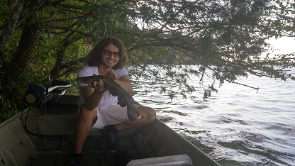

```{r setup, include=FALSE}
knitr::opts_chunk$set(echo = F)
```


##**About** 

I am a graduate research assistant at Mississippi State University, and will finish up my MS in fisheries science by the end of this year.  My research explores new ways to evaluate harvest regulations, through the development of [computer applications](https://acshamaskin.shinyapps.io/YPR_DN/) that can better explain how human dimensions and fish population dynamics interact. 

Aside from my thesis, I spend my time building data-entry-and-analysis software for the Mississippi Department of Wildlife, Fisheries, and Parks.  Here's another [link](https://www.researchgate.net/publication/311482238_The_End_Parenthesis_How_a_Fisheries_Student_Tackled_Programming), for the curious.

Please pardon the dust as I continue to develop this personal website in a manner that is optimally efficacious.  In the meantime, check out my [CV here](https://acshamaskin.github.io/figure/Andrew Challen Shamaskin CV .pdf), and a little personal statement of mine.  

<br>





